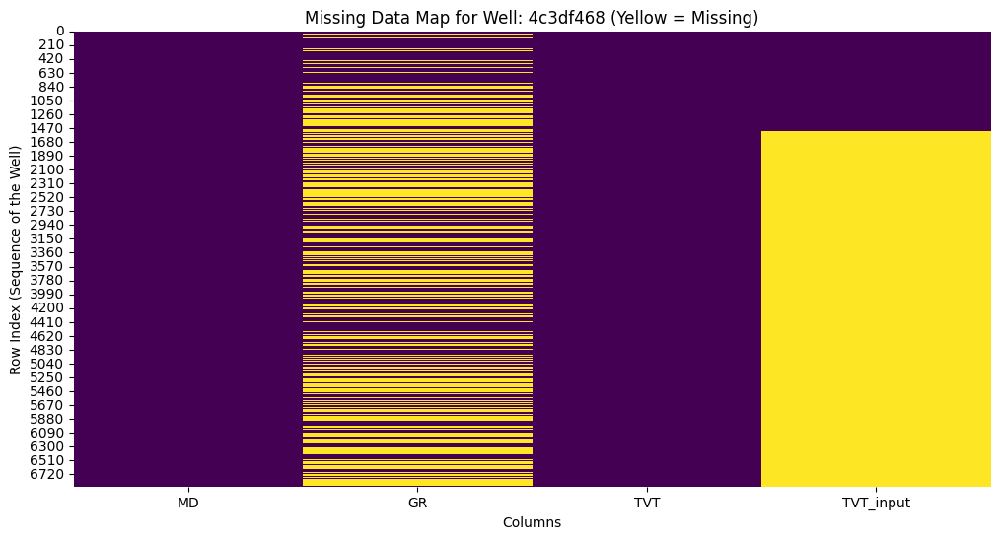
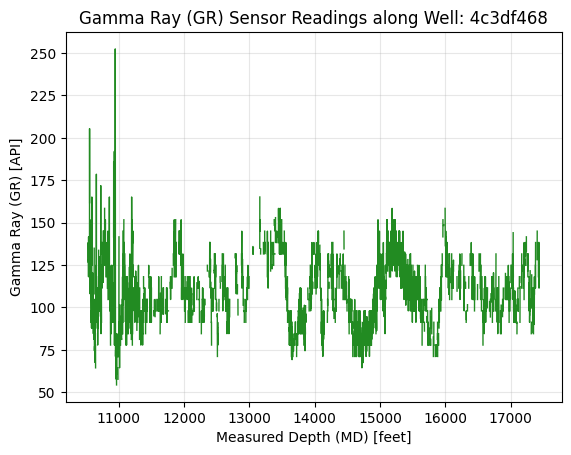

# ROGII Wellbore Geology Prediction 
**Automating Subsurface Interpretation with Deep Learning**

## Executive Summary
This project implements a 1D-Convolutional Neural Network (1D-CNN) to predict geological layers (TVT) in real-time during horizontal drilling. By processing spatial coordinates and Gamma Ray sensor data, the model identifies geological transitions to help automate geosteering operations.

## Key Features
- **Memory-Optimized Pipeline**: Reduced dataset footprint by 50% using strategic downcasting.
- **Sequential Feature Engineering**: Integrated rolling statistical windows and spatial gradients to capture geological context.
- **Deep Learning Architecture**: Utilized a PyTorch-based 1D-CNN to achieve an 11-foot improvement in RMSE over the linear baseline.

## Technical Stack
- **Languages**: Python
- **Libraries**: PyTorch, Scikit-Learn, Pandas, NumPy
- **Architecture**: 1D Convolutional Neural Network (CNN)

## Performance
- **Baseline RMSE**: 29.4196 ft
- **Final Model RMSE**: 14.2456 ft
